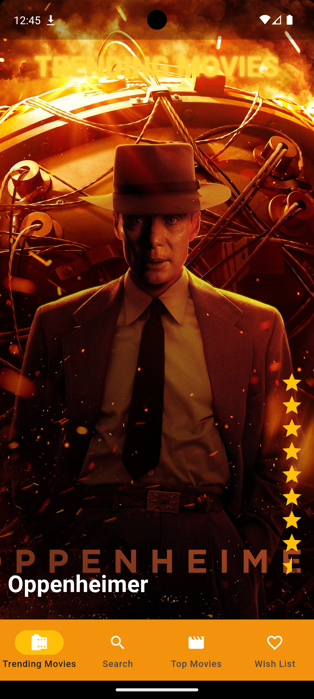

# Ultimate Movie Database

  

Sumérgete en el universo cinematográfico con Ultimate Movie Database, la aplicación para explorar el mundo del cine.

## Descripción General

Ultimate Movie Database está diseñada **Flutter**, siguiendo una **Arquitectura Clean** y **principios SOLID**, además de un **patrón MVVM** para la UI, permitiendo una separación clara entre la presentación y la lógica de negocio, con la ayuda de la inyección de dependencias proporcionada por `GetIt`. Utiliza librerías de vanguardia como `Dio` para las comunicaciones de red, `SharedPreferences` para el almacenamiento local y `GoRouter` para una navegación fluida.

Este proyecto utiliza la [API de The Movie Database (TMDB)](https://developer.themoviedb.org/docs/getting-started), una fuente de información sobre películas, programas de televisión, actores e imágenes relacionadas con el cine y la televisión. Esta API es fundamental para ofrecer a los usuarios acceso a una extensa base de datos de contenido cinematográfico.

## Introducción

Ultimate Movie Database es la aplicación esencial para los entusiastas del cine, ofreciendo una lugar para descubrir y buscar películas de todos los tiempos. Desde los clásicos del cine mudo hasta los últimos lanzamientos, la app pone a tu disposición una vasta colección de películas junto con herramientas de búsqueda y descubrimiento.

Diseñada para ser intuitiva y fácil de usar, Ultimate Movie Database se convierte en el acompañante perfecto para tus noches de cine o simplemente para cuando desees aventurarte en nuevos horizontes cinematográficos.

Únete a nuestra comunidad de cinéfilos y transforma tu forma de interactuar con el cine utilizando Ultimate Movie Database.

## Capturas de pantalla

  
  
  
  
  

## Estructura del Proyecto

La aplicación sigue una **Arquitectura Clean** y **principios SOLID**, y está organizada en las siguientes carpetas de alto nivel dentro de la carpeta `lib/`:

- `data/` - Contiene la implementación de la lógica de acceso a datos, tanto remotos como locales.
  - `genre/` - Operaciones relacionadas con géneros de películas.
  - `movie/` - Operaciones relacionadas con películas.
- `di/` - Configuración de la inyección de dependencias para la aplicación.
- `domain/` - Repositorios y entidades de negocio.
- `model/` - Modelos de datos utilizados a lo largo de la aplicación.
- `ui/` - Elementos de la interfaz de usuario, organizados por pantalla y funcionalidad.
  - `base/` - Clases base para los ViewModels.
  - `views/` - Vistas individuales de la aplicación, cada una con su ViewModel correspondiente.
  - `widgets/` - Widgets reutilizables.
- `main.dart` - Punto de entrada de la aplicación.

Dentro de `ui/`, cada vista de la aplicación está cuidadosamente separada en su propio directorio con su ViewModel específico, lo que facilita la gestión de estados y la navegación.

## Librerías

Para el diseño de una aplicación robusta y escalable, se han utlizado las siguientes librerías en el proyecto:

- [Flutter](https://flutter.dev) - El SDK de UI para crear hermosas aplicaciones compiladas nativamente.
- [Dio](https://github.com/flutterchina/dio) - Un cliente HTTP dinámico y potente para Dart, que facilita el manejo de solicitudes y respuestas.
- [SharedPreferences](https://pub.dev/packages/shared_preferences) - Una solución para almacenar datos de clave-valor de forma persistente, ideal para preferencias de usuario y configuraciones simples.
- [GetIt](https://pub.dev/packages/get_it) - Un localizador de servicios para Dart y Flutter, que se utiliza para la inyección de dependencias.
- [go_router](https://pub.dev/packages/go_router) - Un enrutador declarativo para Flutter que facilita la navegación y la gestión de rutas.

Estas herramientas y librerías se han seleccionado cuidadosamente para trabajar juntas y proporcionar una base sólida y flexible para la **arquitectura MVVM**, facilitando un código mantenible y una experiencia de usuario fluida.

## Instalación

Sigue estos pasos para configurar el entorno de desarrollo y ejecutar la aplicación:

### Clona el repositorio de GitHub
git clone https://github.com/pablo-ziura/ultimate-movie-database.git

### Navega al directorio del proyecto clonado
cd ultimate-movie-database

### Instala las dependencias del proyecto
flutter pub get

### Ejecuta la aplicación en modo de desarrollo
flutter run

### Registro y Uso de la API

Para utilizar la API de TMDB en tu propio entorno de desarrollo, necesitarás registrarte en [The Movie Database (TMDB)](https://developer.themoviedb.org/docs/getting-started) y obtener tu propia clave API.

## Play Store

Puedes instalar y ejecutar la aplicación desde la Play Store: [Ficha Play Store](https://flutter.dev)

## Licencia

Este proyecto está licenciado bajo la Licencia MIT - ver el archivo [LICENSE.md](LICENSE.md) para detalles.